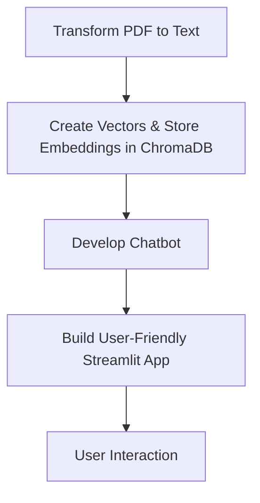

# RAG_Edital_2024 🤖📄

## 🚀 Introduction

Welcome to **RAG_Edital_2024**! This project is an AI-powered chatbot designed to assist users in navigating and understanding the **Dataprev edital** (call for applications). Leveraging advanced language models and a robust database, our chatbot provides accurate and context-aware responses based on the edital content.

## 🎯 Features

- **AI-Powered Chatbot**: Interact with an intelligent assistant to get answers about the Dataprev edital.
- **Streamlit Interface**: User-friendly web application built with Streamlit.
- **ChromaDB Integration**: Efficient storage and retrieval of edital content.
- **Multiple Language Models**: Choose from various language models for customized responses.
- **Conversation History**: Keep track of your interactions for better context understanding.

## 🛠️ Technologies Used

- **Python**
- **Streamlit**: Web application framework
- **ChromaDB**: Database for embeddings
- **Groq API**: For AI model integrations
- **PyMuPDF (fitz)**: PDF text extraction

## 📈 Workflow Diagram

## 📁 Project Structure
RAG_Edital_2024/
├── App.py
├── ChatbotDB.py
├── CreateChromaDB.py
├── ReadWritePDF.py
├── edital.txt
├── dataprev_edital_0.pdf
├── logo.jpg
├── requirements.txt
└── README.md

## 📝 Installation

1. Clone the repository:

git clone https://github.com/RoldanRamon/RAG_Edital_2024.git
cd RAG_Edital_2024

## 🎮 Usage
Start the Streamlit application:
streamlit run App.py

Open your web browser and navigate to http://localhost:8501 to interact with the chatbot.

## 🤝 Contributing
Contributions are welcome! Please open an issue or submit a pull request for any improvements or bug fixes.

## 📜 License
This project is licensed under the MIT License.

## 📫 Contact
Ramon de Lara - LinkedIn
Feel free to reach out for any queries or collaboration opportunities.